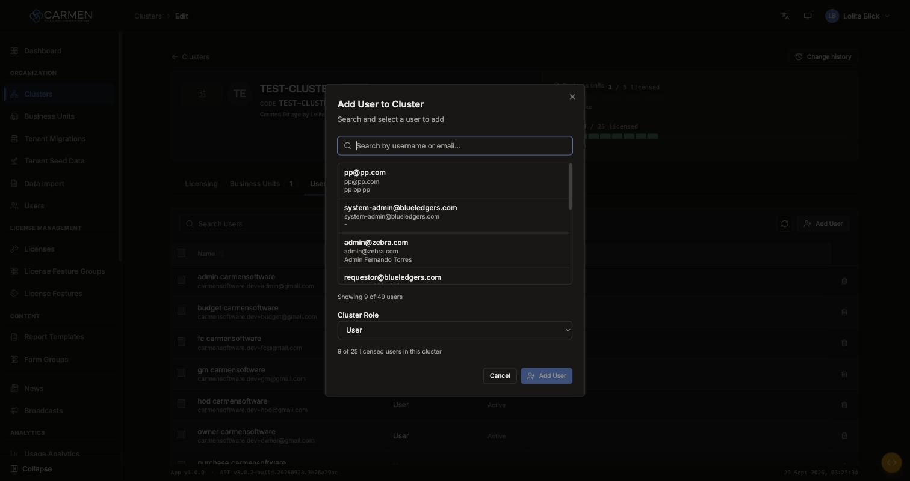

---
**Doc ID:** CP-MODAL-008
**Title:** Add User to Cluster
**Domain:** Carmen Platform — actor: Platform user
**Parent Page(s):** CP-PAGE-007 — Cluster Edit (Users tab)
**Component:** inline `<Dialog>` in `src/pages/ClusterEdit.tsx` (~L689–816); data via `src/pages/clusterEdit/useClusterUsers.ts`
**Status:** Draft
**Created:** 2026-09-29
**Last Updated:** 2026-09-29
**Author:** Claude (from code + live capture on the local backend `localhost:4000`, 2026-09-29)
**Parent Flow:** CP-FLOW-002 — Cluster onboarding (Planned)
---

## 2.3.1.1 Add User to Cluster

> Grants an existing platform user membership of this cluster, as `admin` or `user`. It does
> not create users; that is done in CP-PAGE-011.



---

### 2.3.1.1.1 Trigger

| Trigger | Source Page | Condition |
|---------|------------|-----------|
| Click **Add User** | CP-PAGE-007 (Cluster Edit) → Users tab | Only when `canEdit` (`cluster.update` scoped to this cluster). Edit mode only. |

On open, the dialog clears any previous selection, resets the role to `user` and immediately
loads the first page of users.

---

### 2.3.1.1.2 Modal Layout

```
[Add User to Cluster]                                        [×]
Search and select a user to add
────────────────────────────────────────────────────────────────
[🔍 Search by username or email...]          ← autofocus
┌──────────────────────────────────────────┐
│ username                                 │ ← each row is a button
│ email                                    │
│ full name (or "-")                       │   (infinite scroll)
└──────────────────────────────────────────┘
Showing {shown} of {total} users
────────────────────────────────────────────────────────────────
Cluster Role  [User ▾]
{used} of {cap} licensed users in this cluster      ← red at/over cap
                                   [Cancel] [+ Add User]
```

Once a user is picked, the search and list are **replaced** by a highlighted box showing
that user, with an × ("Clear selected user") to go back to the list.

**Modal Size:** Medium (shadcn `Dialog` default).
**Scrollable:** Yes. Only the result list scrolls (`max-h-60`).

---

### 2.3.1.1.3 Search & Filter

| Filter | Type | Description | Default |
|--------|------|-------------|---------|
| Search | Free text | Matches `username`, `email`, `firstname`, `lastname` on the server | Blank (loads the first 10 of all users) |

**Search trigger:** real time, **400 ms debounce**; a new term resets to page 1.
**Paging:** infinite scroll. The next 10 load when the list is scrolled within 40 px of the bottom; "Loading..." shows meanwhile.

---

### 2.3.1.1.4 Content Grid Columns

| Column | Description | Sortable | Notes |
|--------|-------------|----------|-------|
| Username | Line 1, bold | No | — |
| Email | Line 2 | No | — |
| Full name | Line 3: first + middle + last | No | "-" when all are empty |

**Selection behaviour:**
- **Single-select.** A click selects the user and swaps the list for the selected-user box.
- **Members are hidden:** results whose id matches an existing member's `user_id` are filtered out **on the client**.
- Counter "Showing {shown} of {total} users": `shown` is the count **after** hiding members, `total` is the server total. In the capture (local backend) this read "Showing 9 of 49 users" with 9 existing members, so the two numbers measure different things.

---

### 2.3.1.1.5 Action Buttons

| Button | Color / Type | Description | Behaviour |
|--------|-------------|-------------|-----------|
| Add User | Primary (Blue), UserPlus icon | Adds the selected user | **Disabled** until a user is selected, while adding ("Adding..."), and when the cluster is at its seat cap. Calls `POST /api-system/user/clusters`. |
| Cancel | Secondary (outline) | Closes without changes | No API call |
| × (header) / Esc / backdrop | — | Same as Cancel | — |
| × (selected-user box) | Ghost icon | Clears the selection | Returns to the search list |

---

### 2.3.1.1.6 Outcomes

| User Action | Modal Result | Parent Page Effect |
|------------|-------------|-------------------|
| Select user → Add User (success) | Toast "User added to cluster"; modal closes | Members refetch: the table, the **Users** tab count and the **Seats** rail all update |
| Select user → Add User (failure) | Toast "Failed to add user" + detail; **modal stays open** with the selection kept | No change |
| Cancel / × / Esc | Modal closes | No change |

---

### 2.3.1.1.7 Auto-Population on Selection

The new membership row is created with:

| Parent Field | Pre-populated From |
|------------|-------------------|
| `user_id` | The selected user |
| `cluster_id` | The current page's `:id` |
| `role` | The **Cluster Role** select (default `user`) |
| `is_active` | Always `true`. It cannot be set here, and the Users table cannot change it afterwards. |

Fields NOT pre-populated (user must fill): **Cluster Role**, but it defaults to *User* and
can be left as is.

**Cluster Role options:**

| Option | Value | Meaning |
|--------|-------|---------|
| Admin | `admin` | Cluster admin: gets the Cluster Admin Portal (CP-PAGE-048–053). This is `tb_cluster_user.role`, **not** a platform RBAC role. |
| User | `user` | Ordinary member |

---

### 2.3.1.1.8 Validation & Error States

| # | Scenario | System Behaviour |
|---|----------|-----------------|
| 1 | No user selected → Add User | Button disabled; cannot be clicked |
| 2 | Search returns nothing | "No users found." |
| 3 | Every match is already a member | "All matching users are already in this cluster." |
| 4 | User is already a member (race: added elsewhere after the list loaded) | Not caught on the client. The server rejects it and the generic toast "Failed to add user" + detail appears. The detail is **English only** (`getErrorDetail` is called without `t`) and reads "Please try again later." in production. |
| 5 | Seat cap reached (`members ≥ cap`) | Red notice "Cluster license limit reached ({used}/{cap})"; **Add User disabled**. Inactive members count toward `used`. With no cap there is no notice and no limit. |
| 6 | API fails to load the user list | The list stays empty ("No users found."); no error message. *(Gap)* |
| 7 | Session expired | 401 → silent token refresh + retry; a failed refresh → `/login`, and the dialog state is lost. |
| 8 | Slow network / loading | "Loading..." under the list; Add button shows "Adding..." with a spinner. |
| 9 | Permission | Without `canEdit` the trigger button is not rendered, so the dialog is unreachable. |

---

### 2.3.1.1.9 API Endpoints

| Method | Endpoint | Purpose |
|--------|----------|---------|
| GET | `/api-system/user?search={q}&page={n}&perpage=10&searchfields=username,email,firstname,lastname` | Candidate users (paged) |
| POST | `/api-system/user/clusters` | Create membership. Body: `{ user_id, cluster_id, role, is_active: true }` |
| GET | `/api-system/user/clusters/{clusterId}` | Parent refetch after success |

Response fields used from the user list: `data[].id, username, email, firstname, middlename, lastname`; `paginate.total`.

---

### 2.3.1.1.10 Related Documents

| Doc ID | Title | Relationship |
|--------|-------|-------------|
| CP-PAGE-007 | Cluster Edit | Opens this modal via the Users tab **Add User** |
| CP-PAGE-011 | User Edit | Where a user must exist first. The same user can also be assigned to BUs there (CP-MODAL-009). |
| CP-MODAL-013 | Invite User (Cluster Admin) | Cluster-admin counterpart (invites by email instead) |
| CP-FLOW-002 | Cluster onboarding | Parent flow (Planned) |
