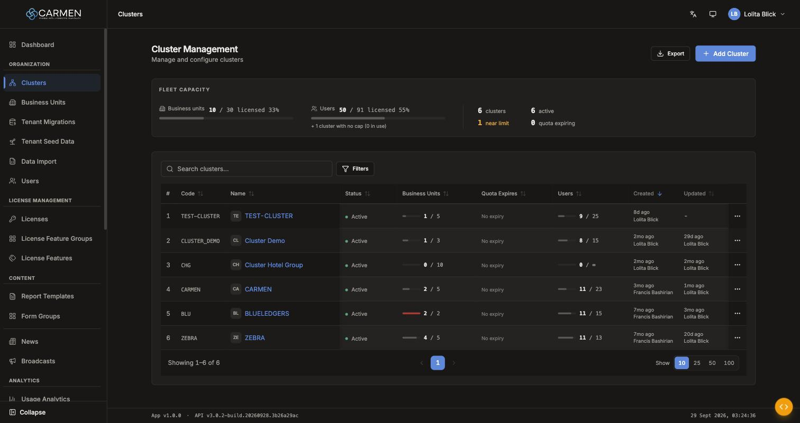
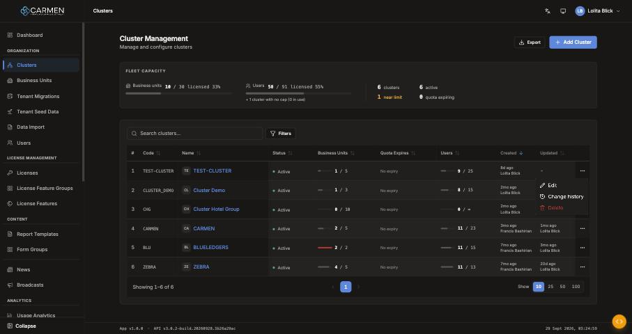
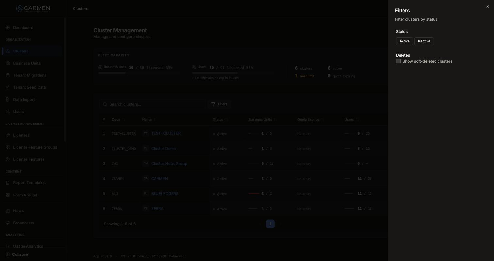

---
**Doc ID:** CP-PAGE-006
**Title:** Cluster List (Cluster Management)
**Domain:** Carmen Platform — actor: Platform user
**Route:** `/clusters`
**Component:** `src/pages/ClusterManagement.tsx` (+ `src/pages/clusterManagement/FleetCapacity.tsx`, `CapacityGauge.tsx`, `CapacityMeter.tsx`)
**Status:** Draft
**Created:** 2026-09-29
**Last Updated:** 2026-09-29
**Author:** Claude (from code + live capture on the local backend `localhost:4000`, 2026-09-29)
**Parent Flow:** CP-FLOW-002 — Cluster onboarding (Planned)
---

## 2.2 Cluster List

> The fleet-wide list of clusters: capacity at a glance, then a server-side table where a
> platform user finds a cluster and opens, audits or soft-deletes it.



---

### 2.2.1 Purpose

A cluster is the top-level tenant (a hotel group) that owns business units and users. This
page answers two questions: **how full is the fleet** (BU and user seats against licences),
and **which cluster do I need**. From here the user goes to CP-PAGE-007 to create or edit
a cluster, opens its change history, or soft-deletes an empty cluster.

---

### 2.2.2 Screen Overview

**Access Path:**
- Sidebar → **Organization** → **Clusters**
- Direct URL: `/clusters`

**Route guard** (`src/App.tsx:112`): `PrivateRoute requiredPermission="cluster.read" feature="clusters"`.
Checks run in this order:
1. Unauthenticated → `/login`.
2. No platform authority but cluster-admin scope → `/cluster-admin` (CP-PAGE-048).
3. Missing `cluster.read` → CP-PAGE-ERR-001 (Forbidden) rendered **in place** (the URL stays the same).
4. Feature flag `clusters`: `hide` → CP-PAGE-ERR-002 (Not Found), `inactive` → Coming Soon.

Permission is checked before the flag, so a user without access sees 403, not 404.

**Permissions Required:**

| Role | Permission | Scope | Notes |
|------|-----------|-------|-------|
| Any platform role | `cluster.read` | Platform | Required to open the page |
| — | `cluster.create` | Platform | Shows **Add Cluster** (header and empty state) |
| — | `cluster.update` | Cluster (`clusterId=row.id`) | Shows row menu → **Edit** |
| — | `activity_log.read` | Cluster | Shows row menu → **Change history** |
| — | `cluster.delete` | Cluster | Shows row menu → **Delete** |

Hidden actions are **removed**, not disabled (`<Can>` renders nothing). **Export** and the
Code/Name links are not gated. A link still leads to `/clusters/:id/edit`, and that route
enforces `cluster.update`, so a read-only user who clicks a name gets the 403 page.

---

### 2.2.3 Screen Layout

```
[PageHeader: "Cluster Management" / "Manage and configure clusters"]   [Export] [+ Add Cluster]
──────────────────────────────────────────────────────────────────────────────────────────────
[2.2.5 FLEET CAPACITY band]
  Business units ▬▬▬ 10 / 30 licensed 33%   Users ▬▬▬ 50 / 91 licensed 55%  │ 6 clusters   6 active
                                            + 1 cluster with no cap (0 in use) │ 1 near limit 0 quota expiring
──────────────────────────────────────────────────────────────────────────────────────────────
[🔍 Search clusters...]  [Filters (n)]
[Filters: (Active ×) (Show Deleted ×)  Clear all]          ← only when a filter is active
[2.2.6 DataTable — # | Code | Name | Status | Business Units | Quota Expires | Users | Created | Updated | ⋯]
[Showing 1–6 of 6]                 [‹ 1 ›]                                 [Show 10 25 50 100]
```

- `#`, **Code** and **Name** are frozen columns (`stickyLeftColumns={3}`) when the table scrolls sideways.
- Below the `lg` breakpoint each row renders as one card: Code and Name form the title, Status is the badge, and **Updated** is hidden.

---

### 2.2.4 Header Information

N/A — this is a list screen and has no header form. The page header has only the title,
the subtitle and the two actions documented in 2.2.7.

| Element | EN | TH |
|---------|----|----|
| Title | Cluster Management | จัดการ Cluster |
| Subtitle | Manage and configure clusters | จัดการและตั้งค่า Cluster |

---

### 2.2.5 Summary Information — Fleet Capacity band

> Loaded from `GET /api-system/clusters/summary`. The endpoint takes **no filters**, so the
> band always shows the whole fleet and does **not** change with search or filters. This is
> deliberate, so do not "fix" it by reading the `summary` that comes back with the list call.

| Tile | Value | Calculation / Remark |
|------|-------|----------------------|
| Business units | `bu.used / bu.cap licensed NN%` | `bu.cap = 0` is a **real zero**, not unlimited. With cap 0 the ratio is 100% if anything is used, otherwise 0%. |
| Users | `users.used / users.cap licensed NN%` | A cap of `0` or `null` means uncapped and shows "∞ (no cap)". The percentage is hidden when uncapped. |
| Uncapped note | "+ {n} cluster(s) with no cap ({used} in use)" | Appears when `uncapped_count > 0`. In practice only on Users, because BU `uncapped_count` stays 0. |
| clusters | `total` | — |
| active | `active` | `inactive` and `deleted` are returned but not shown |
| near limit | `near_limit` | Computed by the backend. Warning colour when > 0. |
| quota expiring | `expiring_soon ?? 0` | Clusters whose winning **BU-quota** licence expires within 30 days (perpetual licences excluded). When > 0 it becomes a toggle button that applies the expiring-soon filter (2.2.12). |

**Gauge colour levels** (`src/utils/capacity.ts`, `NEAR = 0.9`):

| Level | Condition | Bar | Percentage text |
|-------|-----------|-----|-----------------|
| `ok` | < 90% | neutral grey | muted |
| `warn` | 90% up to < 100% | warning | warning |
| `over` | ≥ 100% | destructive (red) | destructive |
| `none` | uncapped | muted | hidden |

**Band states:**

| State | Shows |
|-------|-------|
| First load | 3 skeleton blocks |
| Load failed, no data yet | "Capacity unavailable" (`role="alert"`) |
| Payload missing `bu` or `users` | "Capacity unavailable" |
| A later refresh failed | Last numbers dimmed to 70% opacity + "Couldn't refresh — showing the last known numbers." |

The band refetches after a successful delete. A failure never raises a toast.

---

### 2.2.6 Detail / Grid Information

Server-side `DataTable`. `#` is added by DataTable itself.

| Column | Mandatory | Description | Business Logic / Remark |
|--------|-----------|-------------|--------------------------|
| # | — | Row number | `pageIndex × pageSize + i + 1`. Not sortable. |
| Code | — | Cluster code | Mono text; link → CP-PAGE-007. Sort key `code`. |
| Name | — | Brand mark + name | Link → CP-PAGE-007. If soft-deleted, a destructive **Deleted** badge with the tooltip "Deleted by {name}". Sort key `name`. |
| Status | — | Active / Inactive | A dot + word, **not** a Badge: green dot + muted "Active"; hollow dot + bold "Inactive". Sort key `is_active`. |
| Business Units | — | `bu_used / bu_cap` meter | 40px bar. `cap 0` = real zero. At 90% up to < 100% a **near** tag appears; at ≥ 100% there is no tag, only a red bar. Sort key `bu_count` (server sorts by **used**). |
| Quota Expires | — | End date of the winning BU-quota licence | "—" = no licence; "No expiry" = perpetual (sentinel `2099-12-31T23:59:59.999Z`); otherwise `yyyy-mm-dd` (local time). Sort key `bu_cap_end_date`; nulls always last. |
| Users | — | `users_count / total_max_license_users` meter | `0`, `null` or missing cap → "∞". Sort key `user_count`. |
| Created | — | Relative time + actor | Sort key `created_at` (**default sort, desc**). |
| Updated | — | Relative time + actor | Sort key `updated_at`. Hidden on mobile cards. |
| Deleted | — | When + who | **Only present while "Show soft-deleted clusters" is on.** Destructive text. Not sortable. |
| ⋯ | — | Row action menu | See Grid Actions. aria-label "Actions for {name}". |

A row click does nothing. Only the Code and Name links navigate.

**Grid Actions** (row menu, `align="end"`):



| Button | Description | Business Logic |
|--------|-------------|----------------|
| Edit | Opens CP-PAGE-007 | Needs `cluster.update` |
| Change history | Opens CP-MODAL-003 (Activity Trail Sheet), `entityType="cluster"` | Needs `activity_log.read`. History exists only from **2026-08-31**; earlier changes were not recorded. |
| Delete | Soft-deletes the cluster | Needs `cluster.delete`. **Blocked on the client if `bu_count > 0`**: no dialog, only a toast (see 2.2.14 #8). Otherwise opens CP-MODAL-001. |

No bulk actions: rows cannot be selected.

---

### 2.2.7 Action Buttons

| Button | Color / Type | Description | Business Logic / Validation |
|--------|-------------|-------------|------------------------------|
| Export | Secondary (outline, sm) | Downloads `clusters-YYYY-MM-DD.csv` | Disabled while loading or when there are 0 rows. Exports **only the rows on the current page**, not the full result set. The date is **UTC**. Toast: "Data exported successfully". |
| Add Cluster | Primary (Blue) | Create a cluster | Needs `cluster.create`. Reads "Add" on mobile. → CP-PAGE-007 (create mode). |
| Filters | Secondary (outline, sm) | Opens CP-MODAL-002 (Filter Sheet) | Round count badge = number of active filters |
| Clear all (chip bar) | Link (underlined) | Resets status, deleted and expiring-soon | Also clears their localStorage keys |

**CSV columns:** Code, Name, Alias, Status (raw `true`/`false`), BU Quota, Quota Expires,
Users, Max Licensed Users, Created at, Created by, Updated at, Updated by. Headers follow
the UI language. Cells starting with `= + @ - \t \r` are neutralised against formula
injection. BU **used** and deletion info are **not** exported.

---

### 2.2.8 Document Status

| Status | Badge Colour | Description |
|--------|-------------|-------------|
| `is_active = true` | Green dot + muted text | Cluster in use |
| `is_active = false` | Hollow dot + bold text | Cluster disabled |
| `deleted_at` set | Destructive (red) badge **Deleted** | Soft-deleted. Visible only with "Show soft-deleted clusters". |

**Status Transition Rules:**

| From Status | Action | To Status | Who Can Perform |
|-------------|--------|-----------|-----------------|
| active / inactive | Toggle status on CP-PAGE-007 | inactive / active | `cluster.update` |
| any (with 0 BUs) | Delete (row menu) | deleted (soft) | `cluster.delete` |
| deleted | Restore | — | **Not available in the UI** |

---

### 2.2.9 Workflow History

N/A. There is no approval workflow. Record-level change history is available through
**Change history** → CP-MODAL-003:
`GET /api-system/platform/activity-logs/record/{id}?entity_type=cluster`.

---

### 2.2.10 Modals Triggered from This Page

| Modal ID | Modal Name | Trigger |
|----------|-----------|---------|
| CP-MODAL-001 | Confirm Dialog — "Delete Cluster" | Row menu → **Delete** (cluster has 0 BUs) |
| CP-MODAL-002 | Filter Sheet | **Filters** button |
| CP-MODAL-003 | Activity Trail Sheet | Row menu → **Change history** |

**CP-MODAL-001 instance on this page:**

| Property | Value |
|----------|-------|
| Title | Delete Cluster / ลบ Cluster |
| Description | "Are you sure you want to delete this cluster? This action cannot be undone." |
| Confirm | **Delete** (destructive), shows its own spinner |
| Success | Toast "Cluster deleted successfully"; the list and the fleet band refetch |
| Failure | Toast "Failed to delete cluster" + detail; the dialog stays open |

> The dialog says "cannot be undone", but the backend performs a **soft** delete and the row
> stays visible under "Show soft-deleted clusters". Since the UI has no restore, the copy is
> accurate from the user's side. Worth confirming with the product owner.

**CP-MODAL-002 instance on this page:**



| Filter | Type | Default | Query effect | localStorage |
|--------|------|---------|--------------|--------------|
| Status: Active / Inactive | Multi-toggle | none | Exactly one selected → `where.is_active`. Both selected → no condition. | `filters_clusters` |
| Show soft-deleted clusters | Checkbox | off | Off → `where.deleted_at = null`. On → condition dropped **and** a Deleted column is added. | `filter_clusters_deleted` |

---

### 2.2.11 Navigation

| Action | Destination |
|--------|------------|
| Add Cluster (header / empty state) | → CP-PAGE-007 (Cluster Edit, create mode) `/clusters/new` |
| Code or Name link | → CP-PAGE-007 (Cluster Edit) `/clusters/:id/edit` |
| Row menu → Edit | → CP-PAGE-007 (Cluster Edit) |
| Row menu → Change history | Opens CP-MODAL-003; the route does not change |
| Row click (outside links) | No action |

---

### 2.2.12 Pagination

- Rows per page: 10 / 25 / 50 / 100 (default **10**). A stored value outside the list is prepended to the options.
- Range text: "Showing {from}–{to} of {total}"; with no rows, "No results".
- Default sort: `created_at` **desc**. Sort changes reset to page 1.
- **Search:** "Search clusters...", searches `name` and `code`, **400 ms debounce**, resets to page 1. `⌘/Ctrl + K` focuses it.
- **Expiring-soon filter:** toggled **only** from the band's "quota expiring" stat. It has no control in the Filter Sheet and **no chip** (see 2.2.14 #10).

Every piece of list state persists per browser:

| State | localStorage key |
|-------|------------------|
| perpage | `perpage_clusters` |
| page | `page_clusters` |
| sort | `sort_clusters` |
| search | `search_clusters` |
| status filter | `filters_clusters` |
| show deleted | `filter_clusters_deleted` |
| quota expiring | `filter_clusters_quota_expiring` |

---

### 2.2.13 API Endpoints

All calls go to the `/api-system` backend (the platform registry).

| Method | Endpoint | Purpose |
|--------|----------|---------|
| GET | `/api-system/clusters?page&perpage&search&searchfields=name,code&sort&advance` | List page |
| GET | `/api-system/clusters/summary` | Fleet Capacity band (no params) |
| DELETE | `/api-system/clusters/{id}` | Soft delete |
| GET | `/api-system/platform/activity-logs/record/{id}?entity_type=cluster&page&perpage` | Change history (CP-MODAL-003) |
| GET | `/api-system/platform/activity-logs/{logId}/detail` | Expand one history entry |

**List query syntax:**
- Sort: `sort=created_at:desc`. Clearing the sort sends `sort=`.
- Search: `search=blu&searchfields=name,code` (the key is all lowercase).
- Filters go in `advance` as JSON; `filter` is never sent:
  - Default: `advance={"where":{"deleted_at":null}}`
  - Active only: `advance={"where":{"is_active":true,"deleted_at":null}}`
  - Expiring soon: `advance={"where":{"deleted_at":null,"bu_quota_expiring_soon":true}}`. `bu_quota_expiring_soon` is a **virtual** key that the backend resolves through view `v_cluster_bu_cap`.

**List response fields used:** `id`, `code`, `name`, `alias_name` (CSV only), `avatar.url`,
`is_active`, `bu_count` (fallback `_count.tb_business_unit`), `users_count` (fallback
`_count.tb_cluster_user`), `bu_cap`, `bu_used`, `bu_cap_end_date`, `total_max_license_users`,
audit fields (nested `audit.*` or flat `created_at`/`created_by_name`/`deleted_at`/…),
`paginate.total`.

---

### 2.2.14 Edge Cases & Error States

| # | Scenario | System Behaviour |
|---|----------|-----------------|
| 1 | Mandatory field left blank | N/A: this page has no form. Search accepts an empty value, which clears the search. |
| 2 | Session expired mid-use | The axios interceptor refreshes the token on a 401 and retries the request transparently. Only a failed refresh redirects to `/login`. List state survives in localStorage. |
| 3a | No clusters at all | Empty state: "No clusters yet" / "Get started by creating your first cluster to organize business units." + **Add Cluster** (if `cluster.create`). |
| 3b | Search or filter returns nothing | "No matches found" / "No results match your search or filters. Try adjusting or clearing them." No action button. |
| 4a | List API fails | Red inline banner "Failed to load clusters: {detail}". Table and empty state hidden. In production `{detail}` is always "Please try again later." There is no retry button. |
| 4b | Summary API fails | The band shows "Capacity unavailable" or stale numbers; the table still works. |
| 5 | Stale data (someone else deleted the row or added a BU) | No live update. The table shows what was last fetched. Delete on a stale row relies on the server's answer; the delete call does not send `doc_version`. |
| 6 | Permission differences | Missing actions disappear (see 2.2.2). A read-only user still sees the name links, which lead to the 403 page. |
| 7 | Loading | First load: `TableSkeleton`. Later refetches: a semi-transparent overlay "Loading clusters..." over the existing rows. |
| 8 | Delete a cluster that still has BUs | No dialog. Error toast "Can't delete {name}" — "It still has {n} business unit(s). Delete or move them to another cluster first." The backend does not cascade. |
| 9 | Delete fails on the server | Toast "Failed to delete cluster" + detail; the dialog stays open for a retry. |
| 10 | Expiring-soon filter active | The Filters badge counts it, but there is **no chip** for it, so the chip bar can show only "Clear all". Turn it off by clicking the band stat again or with Clear all. *(UX gap)* |
| 11 | Export with more rows than one page | Only the visible page is exported. *(Possible surprise for users)* |
| 12 | Stale filters from a previous visit | Filters, search and page are restored from localStorage, so the list can open pre-filtered. Look for the chip bar. |

---

### 2.2.15 Differences: Create vs. Edit Mode

N/A: this is a list screen. See CP-PAGE-007.

---

### 2.2.16 Related Documents

| Doc ID | Title | Relationship |
|--------|-------|-------------|
| CP-FLOW-002 | Cluster onboarding | Parent flow (Planned) |
| CP-PAGE-007 | Cluster Edit | Navigated to from this page (create + edit) |
| CP-MODAL-001 | Confirm Dialog | Delete confirmation |
| CP-MODAL-002 | Filter Sheet | Status / deleted filters |
| CP-MODAL-003 | Activity Trail Sheet | Change history |
| CP-PAGE-048 | Cluster Admin Entry | Redirect target for cluster-admin-only users |
| CP-PAGE-ERR-001 | Forbidden | Shown when `cluster.read` is missing |
