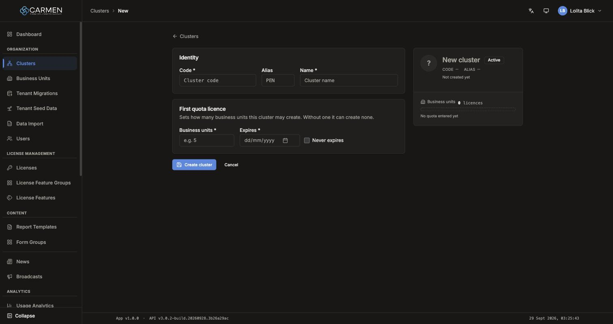
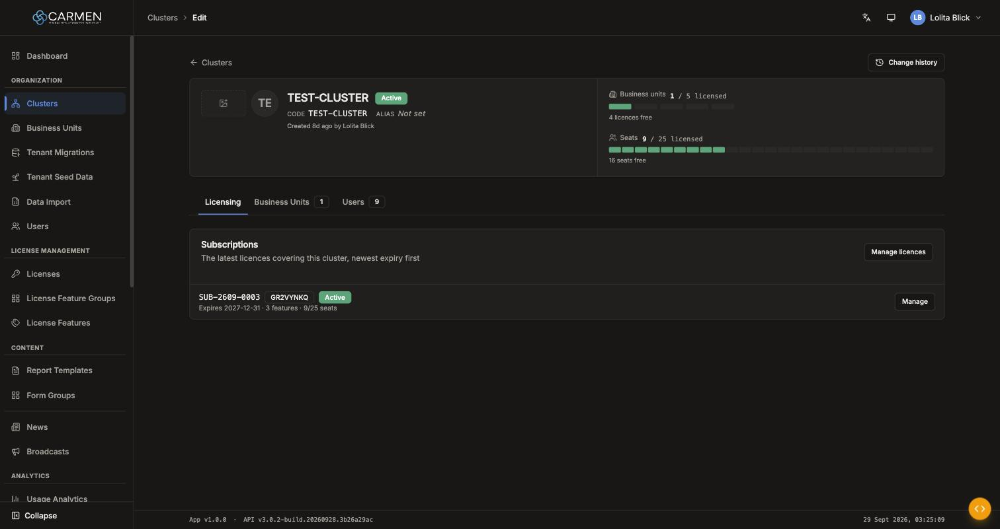
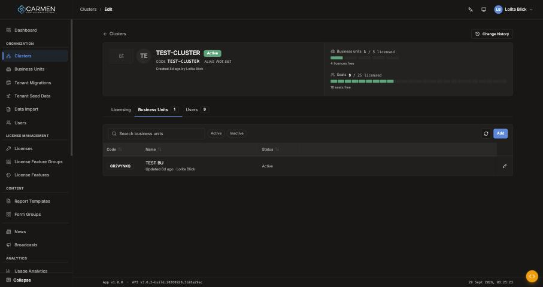
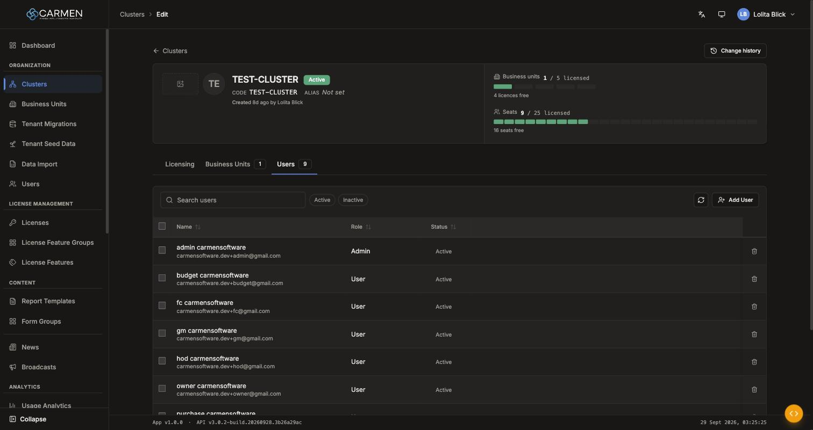

---
**Doc ID:** CP-PAGE-007
**Title:** Cluster Edit (create / edit / read-only)
**Domain:** Carmen Platform — actor: Platform user
**Route:** `/clusters/new`, `/clusters/:id/edit` (`?tab=business-units|users`)
**Component:** `src/pages/ClusterEdit.tsx` + `src/pages/clusterManagement/ClusterCreateForm.tsx` + `src/pages/clusterEdit/*` (`ClusterDraftPlate`, `ClusterPlate`, `PlateField`, `InlineCell`, `BulkActionBar`, `TableToolbar`, `useClusterUsers`, `sections/BusinessUnitsSection`, `sections/UsersSection`, `sections/SubscriptionCard`)
**Status:** Draft
**Created:** 2026-09-29
**Last Updated:** 2026-09-29
**Author:** Claude (from code + live capture on the local backend `localhost:4000`, 2026-09-29)
**Parent Flow:** CP-FLOW-002 — Cluster onboarding (Planned)
---

## 2.3 Cluster Edit

> One screen, two faces. At `/clusters/new` it is a short form with a live preview plate. At
> `/clusters/:id/edit` it is an edit-in-place plate over three tabs (Licensing, Business Units,
> Users) where the cluster's identity, BUs and members are managed.

---

### 2.3.1 Purpose

- **Create:** register a new cluster with its code, alias, name and status, together with
  its **first BU-quota licence**. The backend requires that licence: a cluster with quota 0
  can create no business units at all.
- **Edit:** rename or recode the cluster, toggle its status, upload a logo and avatar, see its
  licence usage, jump to its business units, and manage cluster membership (add or remove
  users, change a member's role).

**Not on this page:** deleting the cluster (done from CP-PAGE-006) and changing the licence
after creation (done in CP-PAGE-016, License Center → cluster).

---

### 2.3.2 Screen Overview

**Access Path:**
- CP-PAGE-006 → **Add Cluster** → `/clusters/new`
- CP-PAGE-006 → Code/Name link, or row menu → **Edit** → `/clusters/:id/edit`
- After a successful create → `/clusters/{newId}/edit` (history entry replaced)
- Direct URL, optionally with `?tab=business-units` or `?tab=users`

**Mode detection:** `isNew = !id`. `canEdit = !isNew && hasPermission('cluster.update', { clusterId: id })`.

**Permissions Required:**

| Role | Permission | Scope | Notes |
|------|-----------|-------|-------|
| Platform user | `cluster.create` | Platform | Route guard for `/clusters/new` |
| Platform user | `cluster.update` | Platform (route) / Cluster (`canEdit`) | Route guard for `/edit`. The route check is unscoped but `canEdit` is scoped, so a user whose `cluster.update` covers only *other* clusters opens this one **read-only**. |
| — | `activity_log.read` | Cluster | **Change history** button |
| — | `cluster.create` | Platform | BU tab **Add** button. It checks `cluster.create`, **not** a business-unit permission. |
| — | `subscription.read` | Platform | Licensing tab content. Without it the tab body is empty and no fetch is made. |
| — | `subscription.manage` | Platform | "Create subscription" button in the empty Licensing tab |

**Field-level permission (edit mode):**

| Field / control | Edit Permission | Remark |
|-----------------|----------------|--------|
| Name, Code, Alias, Status badge | Editable (`canEdit` only) | Disabled otherwise |
| Logo, Avatar upload | Editable (`canEdit` only) | Saved immediately, **not** via Save |
| Users: Add User, checkboxes, bulk Remove, inline Role, row Remove | Editable (`canEdit` only) | Hidden otherwise |
| Users: Status | View Only | Not editable inline, even though the API supports `is_active` |
| BU pencil (→ BU Edit) | Always shown | The BU Edit route enforces its own guard |

---

### 2.3.3 Screen Layout

**Create mode** (two columns from `lg`; below `lg` the plate stacks on top):



```
[← Clusters]
┌ Identity ──────────────────────────────────┐  ┌ Draft plate (sticky) ───────┐
│ Code *        Alias      Name *            │  │ ?  New cluster  [Active]    │  ← status is set HERE
└────────────────────────────────────────────┘  │ CODE —  ALIAS —             │
┌ First quota licence ───────────────────────┐  │ Not created yet             │
│ Business units *   Expires *  ☐ Never expires│ │ Business units 0 licences   │
└────────────────────────────────────────────┘  │ No quota entered yet        │
[Create cluster]  [Cancel]                       └─────────────────────────────┘
```

**Edit mode:**



```
[← Clusters]                                                   [Change history]
┌ Plate ─────────────────────────────────────────┬ Licence rails ───────────────┐
│ [Logo] [Avatar]  NAME (h1)  [Active]           │ Business units 1 / 5 licensed│
│                  CODE xxx   ALIAS Not set      │ ■□□□□  4 licences free       │
│                  Created 8d ago by … · Updated…│ Seats 9 / 25 licensed        │
└────────────────────────────────────────────────┴ ■■■■■■■■■□□…  16 seats free ─┘
[Licensing] [Business Units 1] [Users 9]                     ← sticky TabStrip, ?tab=
───────────────────────────────────────────────────────────────────────────────
[error banner, if any]
[active tab body — 2.3.6]
═══ unsaved bar (only when there are changes): ● Unsaved changes   [Cancel] [Save Changes] ═══
```

There is **no Edit/View toggle**. The page uses the edit-in-place pattern: click a value to
edit it, press Enter or blur to keep it, press Escape to revert it. Pending changes collect
until **Save Changes**. Once the plate scrolls off-screen, compact `bu used/cap` and
`users used/cap` counts fade in at the right of the tab strip.

---

### 2.3.4 Header Information

**Create form** (`ClusterCreateForm`). Defaults are all blank, and `is_active = true`.

| Field | Mandatory | Description | Business Logic / Remark |
|-------|-----------|-------------|--------------------------|
| Code | Y | Cluster code (mono) | `/^[a-zA-Z0-9_-]{2,20}$/` → "Code must be 2-20 alphanumeric characters". Blank → "Code is required". **No uppercase transform.** Validated on blur. |
| Alias | N | Short alias, placeholder `PEN` | `maxLength=3`, `/^[a-zA-Z0-9]{0,3}$/` → "Alias must be 1-3 alphanumeric characters" |
| Name | Y | Display name | Blank → "Name is required". No other rule. |
| Business units | Y | Quota of the first licence | Whole number > 0 → "Must be a positive whole number". Blank → "Business units is required". |
| Expires | Y, unless *Never expires* | Licence end date | Native date input, `min` = today (local). Disabled and not required while *Never expires* is ticked. Checked by the browser only; not validated on blur. Sent as local 23:59:59.999 converted to ISO. |
| Never expires | N | Checkbox | Sends the perpetual sentinel `2099-12-31T23:59:59.999Z` |
| Status | — | Badge on the draft plate | The **only** place to set `is_active` at create time. Defaults to Active. |

Behaviour:
- Focusing a field clears its error; blur re-validates it.
- Submit relies on the browser's native `required` check. There is no JS re-validation before submit.
- The validation messages on this page are **always English**: `validateField` is called without `t`, even though Thai strings exist in the catalog.

**Edit plate:**

| Field | Mandatory | Description | Business Logic / Remark |
|-------|-----------|-------------|--------------------------|
| Name (h1) | (Y) | Inline heading editor | **No validation.** An empty name shows "(unnamed cluster)". |
| Code | (Y) | Inline field | Format rule as in create mode. **Blanking it shows no error** (validated without `required`). |
| Alias | N | Inline field, read-mode placeholder "Not set" | Same regex. The plate input has no `maxLength`, so length is enforced only by the message. |
| Status | Y | Badge; click toggles Active/Inactive | — |
| Logo | N | Rectangular upload | jpeg/png/webp, ≤ 5 MB. Uploads immediately. |
| Avatar | N | Square upload; falls back to initials | Same rules as Logo |

**Read-only fields:** the audit line ("Created … by … · Updated … by …") and both licence rails.

> ⚠️ `handleSaveCluster` does **not** check `fieldErrors`, so a code with a visible format
> error can still be sent. The backend is the last line of defence here.

---

### 2.3.5 Summary Information — Licence rails (edit mode)

| Field | Description | Calculation |
|-------|-------------|-------------|
| Business units | `used / cap licensed`, one tick per licence | `used = number of BUs in this cluster` (client-side count). `cap = bu_cap ?? 0`, and 0 means zero. |
| BU note | "{n} active · {n} inactive · " (only if any inactive) + "{n} licence(s) free" | `cap − used` |
| Seats | `used / cap licensed`, one tick per seat | `used = cluster member count (incl. inactive)`; `cap = total_max_license_users ?? total_count_license_users`. 0 or missing → "∞". |
| Seats note | "{n} active" (if ≠ used) + "{n} seat(s) free", or "no seat cap set" | `cap − used` |

**Draft plate (create mode):** "Business units · {n} licence(s)" drawn as ticks, then the first matching note:
1. "No quota entered yet"
2. "Never expires"
3. "Runs to {date}"
4. "Set an expiry below"

---

### 2.3.6 Detail / Grid Information

#### 2.3.6.1 Licensing tab (default; `?tab` absent)

Heading "Subscriptions", sub-text "The latest licences covering this cluster, newest expiry
first", and a **Manage licences** button → `/licenses/{id}#quota` (CP-PAGE-016).

| Column | Mandatory | Description | Business Logic / Remark |
|--------|-----------|-------------|--------------------------|
| Subscription no. | — | `subscription_number` (mono) | — |
| BU | — | `bu_code` outline badge | — |
| State | — | `state` badge | Success when `active`; secondary otherwise (raw value, capitalised) |
| Summary | — | "Expires {yyyy-mm-dd} · {n} feature(s) · {used}/{cap} seats" | — |
| Manage | — | Button | → `/licenses/subscriptions/{subId}/edit` (CP-PAGE-017) |

- Shows the latest 5 by `end_date desc`.
- Empty: "No subscriptions" / "Create a subscription to grant this cluster its features and seats." + **Create subscription** (needs `subscription.manage`) → `/licenses/subscriptions/new?cluster_id={id}`.
- A fetch failure renders nothing (logged in dev only).

#### 2.3.6.2 Business Units tab (`?tab=business-units`)



Data comes from `GET /api-system/business-units?perpage=-1`, filtered **client-side** by
`cluster_id` and sorted by name.

| Column | Mandatory | Description | Business Logic / Remark |
|--------|-----------|-------------|--------------------------|
| Code | — | Outline badge | Sortable |
| Name | — | Name + compact audit line | Sortable. **Over limit** (destructive) badge when the BU's rank > `bu_cap`; tooltip "Quota {cap} · this unit ranks {rank}". Rank order: HQ first, then oldest `created_at`, then id. |
| Status | — | "Active" (muted) / "Inactive" (secondary badge) | Sortable |
| ✎ | — | Pencil, aria "Edit {name}" | → `/business-units/{buId}/edit` (CP-PAGE-009) |

**Grid Actions:**

| Button | Description | Business Logic |
|--------|-------------|----------------|
| Search | "Search business units" | Instant, client-side, matches code + name |
| Active / Inactive chips | Status filter | Mutually exclusive |
| ⟳ Refresh | Refetch BUs | Spins while loading |
| Add | → `/business-units/new?cluster_id={id}` (CP-PAGE-009, create) | Needs `cluster.create`. **Disabled when used ≥ `bu_cap`**; tooltip "License limit reached ({used}/{cap})". |

If some BUs sit over the quota, a note appears: "{count} business unit(s) … beyond the
licensed quota of {cap} … read-only until more quota is purchased."

#### 2.3.6.3 Users tab (`?tab=users`)



Data comes from `GET /api-system/user/clusters/{id}`, sorted by full name, then email.

| Column | Mandatory | Description | Business Logic / Remark |
|--------|-----------|-------------|--------------------------|
| ☐ | — | Row select | Only when `canEdit`. Header aria "Select all users". |
| Name | — | Display name + email | Sortable. Falls back to name, then email. |
| Role | — | Admin / User | Sortable. Click → select (admin/user); **commits on change** with an optimistic update and a rollback on failure. Escape or blur cancels. Plain text when `!canEdit`. |
| Status | — | "Active" (muted) / "Inactive" (badge) | Sortable. View only. |
| 🗑 | — | Remove, aria "Remove {name} from this cluster" | Only when `canEdit` |

**Grid Actions:**

| Button | Description | Business Logic |
|--------|-------------|----------------|
| Search | "Search users" | Client-side over name, email, username. Changing it clears the selection. |
| Active / Inactive chips | Status filter | Clears the selection |
| ⟳ Refresh | Refetch members | — |
| Add User | Opens CP-MODAL-008 | Only when `canEdit` |
| Remove (row) | CP-MODAL-001 "Remove User from Cluster" — `Remove "{name}" from this cluster?` | `DELETE /api-system/user/clusters/{cuId}`, then refetch. Failure toast "Failed to remove user". **No success toast.** |
| Bulk Remove | Bulk bar "{n} selected" → CP-MODAL-001 "Remove selected users" — "Remove {n} user(s) from this cluster?" | Sequential DELETEs, then one refetch and the selection clears. Result toast is **hard-coded English**: "Remove users: {ok} updated" / "…, {failed} failed" / "…: all {failed} failed". |

`{cuId}` is the membership row id (`tb_cluster_user.id`), **not** the user id.

---

### 2.3.7 Action Buttons

| Button | Color / Type | Description | Business Logic / Validation |
|--------|-------------|-------------|------------------------------|
| Create cluster | Primary (Blue) | Create (create mode) | Browser `required` checks → `POST /api-system/clusters`. Shows "Creating..." with a spinner. Success: toast "Cluster created successfully" → `/clusters/{id}/edit` (replace); if the response has no id → `/clusters`. Failure: banner "Failed to save cluster: {detail}". |
| Cancel (create) | Link / ghost | Leave without creating | → CP-PAGE-006. **No unsaved-changes prompt.** |
| Save Changes | Primary (unsaved bar) | Save edit-mode changes | Only while there are changes. `PUT /api-system/clusters/{id}` with `doc_version`. Success: toast "Changes saved successfully", refetch, stays on the page. Failure: banner. 409: see 2.3.14 #5. `⌘/Ctrl+S` does the same. |
| Cancel (unsaved bar) | Secondary (outline) | Revert all pending edits | No navigation. Clears field errors. `Escape` does the same. |
| Change history | Secondary (outline) | Opens CP-MODAL-003 | Needs `activity_log.read`. History starts 2026-08-31. |
| Manage licences | Secondary (outline) | → `/licenses/{id}#quota` | — |
| ← Clusters (BackLink) | Link | → CP-PAGE-006 | Both modes |

---

### 2.3.8 Document Status

| Status | Badge Colour | Description |
|--------|-------------|-------------|
| `is_active = true` | Success (green) badge "Active" | — |
| `is_active = false` | Badge "Inactive" | — |

**Status Transition Rules:**

| From Status | Action | To Status | Who Can Perform |
|-------------|--------|-----------|-----------------|
| (new) | Create cluster | active (default) or inactive (toggled on the draft plate) | `cluster.create` |
| active | Click badge → Save Changes | inactive | `canEdit` |
| inactive | Click badge → Save Changes | active | `canEdit` |

Deleting is not available here (see CP-PAGE-006).

---

### 2.3.9 Workflow History

N/A: there is no approval workflow. Audit is available as:
- the plate audit line "Created {relative} by {name} · Updated {relative} by {name}";
- a compact audit line per BU row;
- **Change history** → CP-MODAL-003. Entries read "{n} field(s) changed"; the list has "Load more". Empty: "No recorded changes — Recording started on 2026-08-31. Changes made before then were not kept."

---

### 2.3.10 Modals Triggered from This Page

| Modal ID | Modal Name | Trigger |
|----------|-----------|---------|
| CP-MODAL-008 | Add User to Cluster | Users tab → **Add User** (`canEdit`) |
| CP-MODAL-001 | Confirm Dialog — "Remove User from Cluster" | Users tab → row 🗑 |
| CP-MODAL-001 | Confirm Dialog — "Remove selected users" | Users tab → bulk bar **Remove** |
| CP-MODAL-003 | Activity Trail Sheet | **Change history** |

---

### 2.3.11 Navigation

| Action | Destination |
|--------|------------|
| Create success | → CP-PAGE-007 (this page, edit mode) `/clusters/{id}/edit`, history replaced |
| Create cancel / Back | → CP-PAGE-006 (Cluster List) |
| Save (edit) | Stays on this page, refetches |
| Cancel (edit) | Stays; reverts in place |
| Manage licences | → CP-PAGE-016 (Cluster License Detail) `/licenses/{id}#quota` |
| Subscription → Manage | → CP-PAGE-017 (Subscription Form) `/licenses/subscriptions/{subId}/edit` |
| Create subscription | → CP-PAGE-017 (create) `/licenses/subscriptions/new?cluster_id={id}` |
| BU tab → Add | → CP-PAGE-009 (BU Edit, create) `/business-units/new?cluster_id={id}` |
| BU tab → ✎ | → CP-PAGE-009 (BU Edit) `/business-units/{buId}/edit` |
| Tab switch | Same page; `?tab=` updated with `replace` (Licensing = no param) |

---

### 2.3.12 Pagination

N/A. None of the three tabs paginates: BUs are fetched with `perpage=-1` and filtered on the
client, members come from one call, and subscriptions are capped at 5. Tables sort on the
client.

---

### 2.3.13 API Endpoints

All calls go to the `/api-system` backend.

| Method | Endpoint | Purpose |
|--------|----------|---------|
| GET | `/api-system/clusters/{id}` | Load (also after save and after a 409) |
| POST | `/api-system/clusters` | Create. Body: `{code, name, alias_name, is_active, initial_license: {licensed_bus, end_date}}` |
| PUT | `/api-system/clusters/{id}` | Save. Body: `{code, name, alias_name, is_active, doc_version?}`. `doc_version` is sent only if the GET returned one. |
| POST | `/api-system/clusters/{id}/logo` | Multipart `logo`; response `url` |
| POST | `/api-system/clusters/{id}/avatar` | Multipart `avatar`; response `url` |
| GET | `/api-system/business-units?perpage=-1` | All BUs, filtered on the client by `cluster_id` |
| GET | `/api-system/user/clusters/{clusterId}` | Cluster members |
| POST | `/api-system/user/clusters` | Add member (CP-MODAL-008) |
| PUT | `/api-system/user/clusters/{cuId}` | Inline role change. Body `{role}` |
| DELETE | `/api-system/user/clusters/{cuId}` | Remove member (single and bulk) |
| GET | `/api-system/platform/subscriptions?perpage=5&sort=end_date:desc&advance={"where":{"cluster_id":"{id}"}}` | Licensing tab |
| GET | `/api-system/platform/activity-logs/record/{id}?entity_type=cluster` | Change history |

> **Remarks**
> - Update is **PUT**, not the PATCH that the template assumes.
> - `GET /business-units?perpage=-1` pulls **every** BU in the platform to show one cluster's
>   list. It works at today's fleet size (10 BUs) but will not scale. Consider a
>   `cluster_id` filter on the server.

---

### 2.3.14 Edge Cases & Error States

| # | Scenario | System Behaviour |
|---|----------|-----------------|
| 1a | Create: mandatory field blank → Create cluster | The browser's native `required` check blocks submit and focuses the first empty field (Code). The capture (local backend) showed **no inline red message**, only the focus move; the native tooltip does not appear in screenshots. Blur on a blank field shows "Code is required" / "Name is required" inline. |
| 1b | Edit: Code blanked on the plate | **No error shown**, and Save is not blocked. The server's response decides. *(Gap)* |
| 2 | Session expired mid-edit | 401 → the token refreshes silently and the request retries. If the refresh fails → `/login`, and **pending plate edits are lost** (they live only in memory). `beforeunload` does not fire on this redirect. |
| 3a | Unknown / deleted cluster id | The whole page is replaced by "Cluster not found" — "This cluster doesn't exist, or it may have been deleted. Check the link, or pick one from the cluster list." + **Back to clusters**. |
| 3b | Empty tabs | BUs: "No business units found in this cluster." / "No business units match your filters." Users: "No users found in this cluster." / "No users match your filters." Licensing: "No subscriptions" (see 2.3.6.1). |
| 4 | API error on load / save | Red banner "Failed to load cluster: {detail}" / "Failed to save cluster: {detail}". Production shows "Please try again later." as the detail. The banner clears on the next field change. BU and member fetch failures are **silent** (dev log only). |
| 5 | Concurrent edit (stale `doc_version`) | HTTP 409 `DOC_VERSION_CONFLICT` → toast "This record was changed by someone else — Reloading the latest version. Please re-apply your changes." → refetch, and **local edits are discarded**. |
| 6 | Permission differences | Route: `cluster.update` for `/edit`. A scoped `cluster.update` that doesn't cover this cluster → **read-only** page. Missing `subscription.read` → empty Licensing tab. See 2.3.2. |
| 7 | Unsaved changes, then navigate away | Closing the tab or reloading → browser `beforeunload` prompt. **In-app navigation (sidebar, BackLink) is not blocked**; the edits are lost silently. *(Gap vs. Rule 14)* |
| 8 | Escape inside an inline editor | By code reading: the global Escape handler also runs, so it **reverts all pending changes**, not only the field being edited. Not yet verified in the browser. |
| 9 | BU quota full | BU tab **Add** disabled with tooltip "License limit reached ({used}/{cap})". |
| 10 | Seat cap full | CP-MODAL-008 **Add User** disabled; notice "Cluster license limit reached ({used}/{cap})". |
| 11 | Inline role change fails | The role rolls back; toast "Failed to update user". A success shows no toast. |
| 12 | Upload rejected | "Unsupported file type. Allowed: {types}." / "File is too large. Maximum size is 5 MB." / "{Label} upload failed". |
| 13 | Double submit | Create, Save and Add buttons are disabled while saving. `⌘/Ctrl+S` is ignored while saving. |

---

### 2.3.15 Differences: Create vs. Edit Mode

| Behaviour | Create Mode | Edit Mode |
|-----------|------------|-----------|
| Component | `ClusterCreateForm` + `ClusterDraftPlate` | `ClusterPlate` + tabs |
| Guard | `cluster.create` | `cluster.update` (+ scoped `canEdit`) |
| Fields | Code, Alias, Name, first licence (BU qty, expiry) | Name, Code, Alias, Status, Logo, Avatar |
| Status | Toggle on the draft plate | Click the badge |
| Licence | **Required** (`initial_license`) | Read-only rails; change it in CP-PAGE-016 |
| Logo / Avatar | Not available | Upload immediately |
| Tabs (Licensing / BUs / Users) | Not shown | Shown |
| Save trigger | **Create cluster** button / `⌘S` (native form submit) | Unsaved bar **Save Changes** / `⌘S` |
| Unsaved guard | None | `beforeunload` only |
| Validation language | English only | English only |
| After success | Redirect to edit mode | Stay + refetch |
| Delete | — | Not available (use CP-PAGE-006) |

---

### 2.3.16 Related Documents

| Doc ID | Title | Relationship |
|--------|-------|-------------|
| CP-FLOW-002 | Cluster onboarding | Parent flow (Planned) |
| CP-PAGE-006 | Cluster List | Entry point; back target |
| CP-MODAL-008 | Add User to Cluster | Opened from the Users tab |
| CP-MODAL-001 | Confirm Dialog | Remove user(s) |
| CP-MODAL-003 | Activity Trail Sheet | Change history |
| CP-PAGE-009 | Business Unit Edit | Navigated to from the BU tab |
| CP-PAGE-016 | Cluster License Detail | "Manage licences" |
| CP-PAGE-017 | Subscription Form | Subscription Manage / Create |
| CP-PAGE-049 | Cluster Profile (Cluster Admin) | Cluster-admin counterpart. It reuses `DetailsSection`/`BrandingSection`, which this page does **not** render. |
