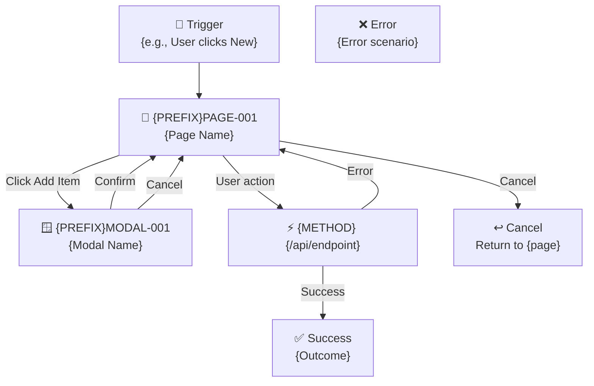

# Flow Template
<!-- Copy this file for every new multi-step workflow. Replace all {PLACEHOLDERS}. -->

---
**Doc ID:** {PREFIX}FLOW-{NNN}
**Title:** {Flow / Workflow Name}
**Domain:** {Domain name}
**Status:** Draft | Review | Stable | Deprecated
**Created:** {YYYY-MM-DD}
**Last Updated:** {YYYY-MM-DD}
**Author:** {Name}
**System:** {Product name — Module name}
**Test User:** {email} / {password} ({roles held})
---

## {N}. Purpose

Describe the business goal of this flow. What end result does the user achieve?

**Workflow context (if this is one stage of a larger workflow):**

| Stage | Role | Action |
|-------|------|--------|
| 1 | {Role} | {Action} |
| **{N}** | **{This Role}** | **{This Action} ← this document** |
| {N+1} | {Next Role} | {Next Action} |

> This document covers **Stage {N} only**. Other stages are in their respective flow docs.

---

## {N}.1 Flow Diagram



**ASCII Text Flow (fallback):**
```
[Trigger] → [{PREFIX}PAGE-001] → [API Call]
                ↓ modal                ↓ success     ↓ error
      [{PREFIX}MODAL-001]       [✅ Outcome]   [❌ Back to form]
```

---

## {N}.2 Flow Steps

### Step 1 — {Step Name}

1. {Actor} navigates to / clicks {element}
2. System displays {screen / modal} ({PREFIX}PAGE-{NNN})
3. {Actor} completes {action}
4. System validates {rules}
5. On success → Step 2. On failure → {behaviour}.

---

### Step 2 — {Step Name}

1. ...

*(Continue for each step)*

---

## {N}.3 Approval Actions (if applicable)

The approver can take one of these actions:

**Approve:**
1. Approver clicks **Approve**
2. System validates: {conditions}
3. On success: document advances to next stage
4. Next party notified
5. Workflow history: action = `approve`, next_stage = `{Stage}`

**Reject:**
1. Approver clicks **Reject**
2. System prompts for rejection reason (mandatory)
3. Status → `rejected`. Requestor notified with reason.
4. Workflow history: action = `reject`, reason = {note}

**Send Back:**
1. Approver clicks **Send Back**
2. System prompts for send-back reason (mandatory)
3. Document reverts to previous stage. Previous party notified.
4. Workflow history: action = `sendback`, reason = {note}

---

## {N}.4 Approval View — Side Bar vs. Full Page

| Feature | Side Bar View | Full Page View |
|---------|--------------|----------------|
| Doc reference | {PREFIX}PAGE-{NNN} | {PREFIX}PAGE-{NNN} |
| Use case | Quick review alongside list | Detailed review |
| Header fields | Key fields only | All fields |
| Editable fields | {list} | {list + additional} |
| Workflow History | Not shown | Shown |

### Side Bar — Editable Fields

| Field | Edit Permission | Description | Remark |
|-------|----------------|-------------|--------|
| Approved Qty | **Editable** | Approver sets approved qty | Must be ≤ Requested Qty |
| {Field} | View Only | {Description} | — |

### Full Page — Additional Editable Fields

| Field | Edit Permission | Description |
|-------|----------------|-------------|
| Delivery Date | **Editable** | Approver can adjust per-line |
| Remark | **Editable** | Per-line notes |

### Button Visibility Rules (State Matrix)

| Scenario | Approve | Reject | Send Back |
|----------|---------|--------|-----------|
| {Condition 1} | Hidden | Hidden | Hidden |
| {Condition 2} | **Active** | Hidden | Hidden |
| {Condition 3} | Hidden | **Active** | Hidden |

---

## {N}.5 Status Transitions

| From Status | Action | To Status | Stage Transition |
|-------------|--------|-----------|-----------------|
| {status} | {action} | {status} | {from} → {to} |

---

## {N}.6 Business Rules

| # | Rule | Detail |
|---|------|--------|
| 1 | {Rule name} | {Description and when it applies} |

---

## {N}.7 Permissions

| Permission | Access |
|------------|--------|
| `{permission.key}` | {Description of access scope} |

---

## {N}.8 Workflow History Entries

| Action | history.action value | Notes |
|--------|---------------------|-------|
| {Role} approves | `approve` | next_stage = `{Stage}` |
| {Role} rejects | `reject` | reason field populated |
| {Role} sends back | `sendback` | reason field populated; next_stage = {Stage} |

---

## {N}.9 API Endpoints

| Method | Endpoint | Purpose |
|--------|----------|---------|
| GET | `/api/{resource}/my-pending` | Fetch items pending this user's action |
| GET | `/api/{bu_code}/{resource}/{id}` | Load full detail |
| POST | `/api/{bu_code}/{resource}/{id}/approve` | Approve at current stage |
| POST | `/api/{bu_code}/{resource}/{id}/reject` | Reject |
| PATCH | `/api/{bu_code}/{resource}/{id}` | Update editable fields / send back |

> If any endpoint uses an unusual HTTP method (e.g., GET for a state-changing action),
> add a remark explaining why.

---

## {N}.10 Edge Cases & Error States

| # | Scenario | System Behaviour |
|---|----------|-----------------|
| 1 | {Scenario} | {Behaviour} |

---

## {N}.11 Constituent Documents

| Doc ID | Title | Type | Role in Flow |
|--------|-------|------|-------------|
| {PREFIX}PAGE-{NNN} | {Page Name} | Page | {e.g., "Entry point"} |
| {PREFIX}MODAL-{NNN} | {Modal Name} | Modal | {e.g., "Item selection"} |

---

## {N}.12 Related Documents

| Doc ID | Title | Relationship |
|--------|-------|-------------|
| {PREFIX}FLOW-{NNN} | {Flow name} | {Upstream / Downstream} |

---

## {N}.13 Ancillary Functions (if applicable)

### Attachments
- Supported: {Yes/No}
- File types: {PDF, Excel, Image, etc.}
- Max size: {N} MB

### Comments
- Users with access can add comments
- Comments are immutable once saved

### Activity Log
- Every status change, edit, and approval is logged
- Log is read-only
